# System Patterns: Spelling Bee Adventure

## Overall Architecture
- **Single Page Application (SPA):** Built with React.
- **Component-Based:** UI is broken down into reusable React components (e.g., `WordDisplay`, `SpellingInput`, `ScoreDisplay`, `Timer`, `ScoreBoard`).
- **Client-Side Logic:** All game logic, state management, and rendering happen in the user's browser.
- **Data Persistence:** Uses browser `localStorage` for saving progress and game state between sessions. No backend server involved.
- **Config-Driven Systems:**
  - Scoring rules defined in `src/config/scoringConfig.js`
  - UI patterns follow consistent styling rules in `App.css`
  - Component state management follows clear patterns

## Key Components & Interactions (Updated)

```mermaid
graph TD
    App[App.js] --> GameScreen[GameScreen.js]

    GameScreen --> WordDisplay[WordDisplay.js]
    GameScreen --> SpellingInput[SpellingInput.js]
    GameScreen --> ScoreDisplay[ScoreDisplay.js]
    GameScreen --> Timer[Timer.js]
    GameScreen --> FeedbackDisplay[FeedbackDisplay.js]
    GameScreen --> HintSystem[HintSystem.js]
    GameScreen --> AlphabetHelper[AlphabetHelper.js]
    GameScreen --> StatsDisplay[StatsDisplay.js]

    App --> DataUtils[src/utils/wordManager.js]
    App --> StorageUtils[src/utils/storageManager.js]
    App --> ScoringConfig[src/config/scoringConfig.js]
    App --> ScoreCalc[src/utils/scoreCalculator.js]

    GameScreen --> DataUtils
    GameScreen --> StorageUtils
    GameScreen --> ScoringConfig
    GameScreen --> ScoreCalc

    WordDisplay -- Triggers Pronunciation --> WebSpeechAPI[Web Speech API]
    SpellingInput -- Sends Letter --> GameScreen
    GameScreen -- Calculates Score --> ScoreCalc
    GameScreen -- Reads Rules --> ScoringConfig
    GameScreen -- Updates Score --> ScoreDisplay
    GameScreen -- Persists Attempt --> StorageUtils
    GameScreen -- Updates Word/Feedback --> WordDisplay
    GameScreen -- Shows Feedback --> FeedbackDisplay
    GameScreen -- Manages Timer --> Timer
    GameScreen -- Manages Hints --> HintSystem
    GameScreen -- Reads/Writes Progress --> StorageUtils
    StorageUtils -- Interacts --> LocalStorage[localStorage API]

    style App fill:#f9f,stroke:#333,stroke-width:2px
    style GameScreen fill:#ccf,stroke:#333,stroke-width:2px
    style DataUtils fill:#cfc,stroke:#333,stroke-width:1px
    style StorageUtils fill:#cfc,stroke:#333,stroke-width:1px
    style ScoringConfig fill:#ffe4b3,stroke:#333,stroke-width:1px
    style ScoreCalc fill:#ffe4b3,stroke:#333,stroke-width:1px
    style ScoreDisplay fill:#ffd699,stroke:#333,stroke-width:1px
    style WebSpeechAPI fill:#fcc,stroke:#333,stroke-width:1px
    style LocalStorage fill:#fcc,stroke:#333,stroke-width:1px
```

## State Management Pattern
- **Initial:** Primarily `useState` within components. State like `currentWord`, `userSpelling`, `score`, `timerValue`, `mode` will likely reside in `GameScreen.js` or `App.js` and be passed down as props.
- **Potential Evolution:** If prop drilling becomes cumbersome (especially with settings or stats), `useContext` might be introduced for more global state elements.

## Data Flow (Updated)
1.  **Load:** On app start, `App.js` uses `wordManager.js` to load `wordList.json` and `storageManager.js` to load any saved progress from `localStorage`.
2.  **Game Loop:**
    *   `GameScreen.js` selects a word (using `wordManager.js`, considering difficulty).
    *   Word/state passed to `WordDisplay.js`, `SpellingInput.js`.
    *   User interacts with `SpellingInput.js` (virtual keyboard).
    *   Input is sent back to `GameScreen.js`.
    *   `GameScreen.js` validates input, updates state (`userSpelling`, score, word stats, streak, timing).
    *   **Scoring:** `GameScreen.js` uses `scoreCalculator.js` and `scoringConfig.js` to calculate base, speed, and streak bonuses. Results are shown via `ScoreDisplay.js`.
    *   **Persistence:** Each attempt's score breakdown is saved via `storageManager.js` to `localStorage` for analytics/statistics.
    *   Updated state flows down to child components (`WordDisplay`, `ScoreDisplay`, `ScoreBoard`).
    *   Feedback is triggered (`FeedbackDisplay.js`, sounds).
    *   Progress is saved via `storageManager.js` to `localStorage` after each word attempt or session end.
3.  **Pronunciation:** `WordDisplay.js` interacts directly with the Web Speech API when the "Listen" button is clicked.

## Key Algorithms
- **Word Selection:** Random selection initially, evolving to prioritize words with `difficulty > 1`. Needs a weighted random selection mechanism.
- **Difficulty Calculation:** Increment `difficulty` counter (max 3) if word spelled incorrectly >= 2 times total. Decrement (min 1) if spelled correctly (perhaps after a small streak on that word).
- **Scoring:** Calculate base points + speed bonus (requires timing the answer) + streak bonus (requires tracking consecutive correct answers). All rules are config-driven and calculated in a pure utility.
- **Persistence:** Each attempt's score breakdown (base, speed, streak, total, word, time, streakCount, correctness) is saved for future analytics/statistics.

## Styling Pattern
- **Global Styles:** 
  - Resets and base styles in `index.css`
  - Theme variables and shared patterns in `App.css`
  - Consistent spacing and layout rules
  - Semantic color system

- **Component Styles:** 
  - Consistent class naming conventions
  - Modular organization by component
  - State-based styling (hover, active, disabled)
  - Animation patterns for transitions

- **Responsiveness:** 
  - Mobile-first approach
  - Flexbox-based layouts
  - Consistent breakpoints
  - Fluid typography and spacing
